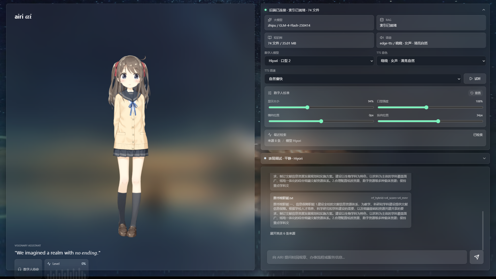

# AIRI Digital Human Assistant

[](LICENSE)
[](docs/06_FINAL_ACCEPTANCE.md)
[](docs/04_RAG_SYSTEM_AND_EVALUATION.md)

融合大模型技术的数字人智能问答平台。本项目来自本科毕业设计《融合大模型技术的数字人智能问答平台设计与研究》，目标是在低成本、本地 CPU 可运行、免费层级 API 限速的约束下，做出一个可运行、可评估、可解释的数字人问答系统。

系统把校园知识库 RAG、GLM 大模型生成、TTS 语音合成、Live2D 数字人展示、AIRI 风格音频队列与口型/动作驱动整合成一条完整交互链路：

```text
用户提问 -> RAG 检索 -> LLM 生成 -> 来源展示 -> TTS 语音 -> Live2D 动作与口型
```



## Repository Topics

Suggested GitHub topics:

```text
rag, llm, fastapi, react, vite, live2d, digital-human, tts, campus-assistant, openai-compatible
```

## Features

- **Portable RAG v4**: 无训练、轻量、可迁移的 RAG 管线，支持 BM25、TF-IDF、字符 n-gram、RRF 融合、parent-child chunk、source expansion、MMR evidence selection 和统计置信度拒答。
- **Grounded chat backend**: FastAPI 后端通过 OpenAI-compatible client 接入智谱 GLM 或 Gemini，并把 RAG 证据、长期记忆和数字人动作事件组织为流式问答。
- **Digital human frontend**: React + Vite + PixiJS + Live2D 前端，支持多模型切换、逐模型 profile、表情/动作映射、调试面板和实时 Level Meter。
- **Speech and lip sync**: 使用 `edge-tts` 生成中文语音，结合 mouth cues 与 `wlipsync` 驱动 Live2D 口型。
- **AIRI migration**: 从 `moeru-ai/airi` 参考并迁移音频队列、TTS chunker、wLipSync、motion update、自动眨眼、眼球注视和 beat-sync 等能力。
- **Reproducible evaluation**: 保留校园知识库、正负例评测集、离线评估脚本、答案级标注报告和最终验收记录。

## Tech Stack

| Layer | Stack |
| --- | --- |
| Backend | Python, FastAPI, Uvicorn, OpenAI-compatible client |
| RAG | BM25, TF-IDF, RRF, MMR, extractive grounded answer |
| Frontend | React, Vite, PixiJS, pixi-live2d-display |
| Avatar | Live2D Cubism models, model profiles, semantic actions |
| Speech | edge-tts, wlipsync, HTMLAudioElement playback queue |
| Evaluation | Offline retrieval/evidence metrics, CSV answer-level annotation |

## Current Status

The platform passed local acceptance testing on 2026-04-23:

| Check | Result |
| --- | --- |
| Backend `/api/system/status` | 200 OK |
| Frontend home page | 200 OK |
| RAG corpus | 74 files / 32635 evidence units |
| Live2D models | 8 detected models |
| Chinese TTS voices | 18 voices |
| Browser console | 0 errors / 0 warnings |

See [docs/06_FINAL_ACCEPTANCE.md](docs/06_FINAL_ACCEPTANCE.md) for the full record.

## RAG Evaluation

PortableRAGV4 is evaluated as a local, training-free retrieval and extractive answering system. The strict answer-level evaluator does not call an LLM.

| Metric | Value |
| --- | ---: |
| Positive questions | 1264 |
| Negative questions | 60 |
| Source hit at k | 0.877373 |
| Evidence term recall | 0.871571 |
| Positive strict accuracy | 0.560127 |
| Positive usable accuracy | 0.731804 |
| Overall strict accuracy | 0.552870 |
| Overall usable accuracy | 0.716767 |

The project intentionally separates retrieval proxy metrics from real answer usability. Details are in [docs/04_RAG_SYSTEM_AND_EVALUATION.md](docs/04_RAG_SYSTEM_AND_EVALUATION.md).

## Quick Start

Requirements:

- Windows + PowerShell
- Python virtual environment in `venv`
- Node.js and npm
- API key for the selected chat provider

Copy the environment template:

```powershell
Copy-Item .env.example .env
```

Edit `.env` and fill at least:

```text
CHAT_PROVIDER=zhipu
CHAT_MODEL=GLM-4-Flash-250414
OPENAI_BASE_URL=https://open.bigmodel.cn/api/paas/v4/
OPENAI_API_KEY=your_api_key
RAG_STRATEGY=portable_v4
KNOWLEDGE_DIR=experiments/rag_reproduction/data
```

Start the backend:

```powershell
.\scripts\run_backend.ps1
```

Start the frontend:

```powershell
.\scripts\run_frontend.ps1
```

Open:

```text
http://127.0.0.1:5173
```

Check backend status:

```powershell
Invoke-WebRequest -UseBasicParsing http://127.0.0.1:8000/api/system/status
```

More setup notes are in [docs/03_SETUP_AND_RUN.md](docs/03_SETUP_AND_RUN.md).

## Run RAG Experiments

Run one question in answer mode:

```powershell
.\scripts\run_rag_reproduction.ps1 portable-v4 --question "学籍证明在哪里办理？" --mode answer
```

Run retrieval-only mode:

```powershell
.\scripts\run_rag_reproduction.ps1 portable-v4 --question "学籍证明在哪里办理？" --mode retrieve
```

Run a smoke evaluation:

```powershell
.\scripts\run_rag_reproduction.ps1 portable-v4-eval --limit 20 --negative-size 10 --output-name portable_rag_v4_smoke
```

## Project Structure

```text
backend/                         FastAPI backend, chat service, memory, TTS, RAG adapter
frontend/                        React frontend, Live2D stage, AIRI migration modules
experiments/rag_reproduction/    Portable RAG v4 implementation, datasets, reports
docs/                            Architecture, setup, RAG, avatar migration, acceptance docs
scripts/                         Local run scripts
data/                            Runtime indexes, TTS cache, local memory database
thesis_materials/                Thesis writing materials and generated figures
```

## API Overview

| Method | Path | Description |
| --- | --- | --- |
| GET | `/api/health` | Health check |
| GET | `/api/system/status` | Backend, RAG, TTS, memory, avatar status |
| GET | `/api/avatar/models` | Scans available Live2D models |
| GET | `/api/tts/voices` | Lists Chinese TTS voices |
| POST | `/api/chat/stream` | SSE chat endpoint |
| POST | `/api/tts` | Generates TTS audio and mouth cue headers |

## Documentation

- [Project overview](docs/01_PROJECT_OVERVIEW.md)
- [Architecture](docs/02_ARCHITECTURE.md)
- [Setup and run](docs/03_SETUP_AND_RUN.md)
- [RAG system and evaluation](docs/04_RAG_SYSTEM_AND_EVALUATION.md)
- [Digital human and AIRI migration](docs/05_DIGITAL_HUMAN_AND_AIRI_MIGRATION.md)
- [Final acceptance](docs/06_FINAL_ACCEPTANCE.md)
- [Thesis writing notes](docs/07_THESIS_WRITING_NOTES.md)

## Limitations

- This is a research and graduation-project prototype, not a production campus service.
- LLM generation depends on external provider availability and rate limits.
- `edge-tts` may fail when the network or upstream service is unstable.
- Negative rejection and real-time/out-of-scope question handling still need improvement.
- Some Live2D models and third-party assets have their own licenses and are not original assets of this project.

## Contributing

Issues and suggestions are welcome, especially around setup reproducibility, RAG evaluation, refusal behavior, security boundaries, and documentation. See [CONTRIBUTING.md](CONTRIBUTING.md).

For vulnerability reports, see [SECURITY.md](SECURITY.md).

## Open Source Scope

The original code and documentation in this repository are released under the MIT License. Third-party source snapshots, Live2D models, Cubism samples, and other bundled assets remain under their original licenses and notices. See the license files inside the corresponding asset directories when reusing them.

## License

MIT License. See [LICENSE](LICENSE).
