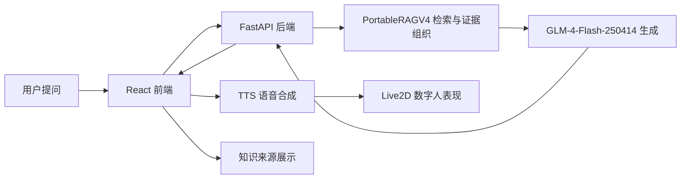

# 项目概述

## 选题

融合大模型技术的数字人智能问答平台设计与研究。

## 建设目标

本项目希望把“能问答的 RAG 系统”和“能表现的数字人前端”整合成一个本地可运行的平台。它既服务毕业设计演示，也服务论文中的系统设计、算法复现、实验评估和工程实现叙述。

核心目标包括：

- 构建校园知识库智能问答能力，支持规章制度、办事流程和服务信息查询。
- 使用大模型完成自然语言回答，但用 RAG 证据约束回答，降低幻觉。
- 在免费层级 API 和本地低算力约束下运行，避免依赖本地大模型训练。
- 复现并工程化参考 CRAG、DeepNote、RAGEval、RAGChecker/RAGAS 等思想的轻量 RAG 流程。
- 迁移 AIRI 开源项目中与数字人表现相关的音频、口型、动作和舞台能力。
- 支持多 Live2D 模型、多 TTS 音色、语音播放中断/替换、口型同步和调试面板。

## 最终范围

项目最终由四条主线组成：

| 模块 | 当前实现 |
|---|---|
| 问答后端 | FastAPI + OpenAI-compatible client + GLM/Gemini provider adapter |
| RAG 系统 | PortableRAGV4，可迁移、无训练、无固定问题规则、支持离线评估 |
| 数字人前端 | React + Vite + PixiJS + Live2D，多模型切换和逐模型 profile |
| 语音与表现 | edge-tts、音频队列、AIRI 风格 wLipSync、Level Meter、动作调试 |

## 技术路线

## 研究与工程贡献

可以在论文中重点表达的贡献：

- 提出面向低算力和免费 API 约束的数字人问答平台架构。
- 构建了可迁移的 Portable RAG v4，而不是针对固定问题池继续堆规则。
- 将评估拆分为检索层、证据层、答案层和安全拒答层，避免单一“看起来很高”的代理指标误导结论。
- 对 AIRI 开源项目进行源码级功能迁移，把音频队列、wLipSync、Live2D motion/idle、逐模型 profile 等能力落地到本项目 React 前端。
- 完成校园知识库问答、语音播报、数字人动作口型同步和可视化调试的一体化平台。

## 约束说明

- 不进行训练或微调。
- 不依赖本地 GPU。
- 不把某个校园知识库问题写成 Python 规则。
- GLM 免费层级存在速率限制，因此实验评估以离线、无 LLM 的指标为主，LLM 主要用于平台实际回答。
- TTS 使用 edge-tts 库，不再依赖付费语音 API。

