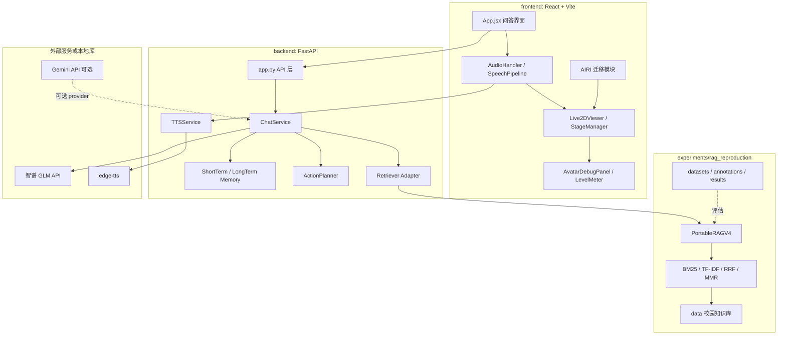

# 系统架构

## 总体架构

## 后端模块

| 路径 | 作用 |
|---|---|
| `backend/app.py` | FastAPI 入口，注册健康检查、系统状态、模型列表、TTS、聊天流接口 |
| `backend/core/config.py` | `.env` 配置读取，统一管理 LLM、RAG、TTS、记忆路径 |
| `backend/services/chat_service.py` | 聊天主流程，组织 RAG、记忆、大模型、动作 token 和流式输出 |
| `backend/rag/retrievers/portable_v4.py` | 将实验区 PortableRAGV4 接入平台的适配器 |
| `backend/avatar/tts.py` | edge-tts 封装、TTS 音色列表、音频和口型 cue 生成 |
| `backend/avatar/action_planner.py` | 非 LLM 优先的动作规划，为前端数字人提供语义动作 |
| `backend/memory/` | 短期上下文和长期记忆数据库 |

## 前端模块

| 路径 | 作用 |
|---|---|
| `frontend/src/App.jsx` | 主界面、状态栏、问答区域、控制面板 |
| `frontend/src/hooks/useChatLogic.js` | SSE 聊天流、动作 token 解析、回答与来源状态管理 |
| `frontend/src/Live2DViewer.jsx` | Live2D 舞台组件入口 |
| `frontend/src/avatar/live2dStageManager.js` | 模型加载、切换、自适应缩放、idle/interaction motion |
| `frontend/src/avatar/modelRegistry.js` | 扫描并合并后端模型信息和本地 profile |
| `frontend/src/avatar/modelProfilePresets.js` | 每模型缩放、位置、口型参数、动作组策略 |
| `frontend/src/utils/audioHandler.js` | TTS 调用、音频播放、口型同步、语音状态广播 |
| `frontend/src/airi/` | 从 AIRI 迁移和重构的音频、Live2D、wLipSync 能力 |

## 请求链路

1. 用户在前端输入问题。
2. `useChatLogic` 通过 `POST /api/chat/stream` 建立 SSE 流。
3. 后端 `ChatService` 调用 `PortableV4Retriever`。
4. `PortableRAGV4` 从校园知识库中检索证据，生成可引用的 answer hint 和 hits。
5. 后端将证据组织进 prompt，调用 GLM 生成回答。
6. 后端流式返回 token、sources、retrieval、avatar action 等事件。
7. 前端显示回答和知识来源，同时解析动作 token，驱动 Live2D 表情/动作。
8. 回答句子进入 TTS pipeline，生成音频后播放。
9. 播放音频时，wLipSync 和 mouth cue 驱动 Live2D 嘴型，Level Meter 显示能量。

## API 摘要

| 方法 | 路径 | 说明 |
|---|---|---|
| GET | `/api/health` | 后端健康检查 |
| GET | `/api/system/status` | LLM、RAG、TTS、记忆、数字人状态 |
| GET | `/api/avatar/models` | 扫描前端 public 中的 Live2D 模型 |
| GET | `/api/tts/voices` | 返回 edge-tts 可选音色 |
| POST | `/api/chat/stream` | SSE 流式问答 |
| POST | `/api/tts` | 生成语音，并通过 header 返回 mouth cues |

## 数据与状态

| 路径 | 说明 |
|---|---|
| `experiments/rag_reproduction/data` | 平台当前校园知识库 |
| `experiments/rag_reproduction/datasets` | 问答评测集和负例集 |
| `experiments/rag_reproduction/indexes` | RAG 实验索引和结构化证据缓存 |
| `data/indexes` | 平台运行时索引目录 |
| `data/tts_cache` | TTS 音频缓存 |
| `data/memory` | 长期记忆 SQLite 数据库 |

