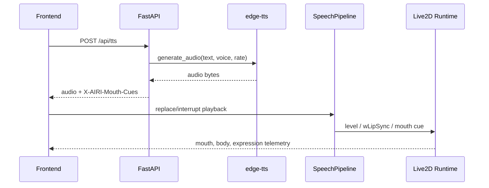

# 数字人与 AIRI 迁移

## 目标

数字人部分的目标不是只把 Live2D 模型放在页面上，而是让模型能“像助手一样表现”：

- 平常保持自然待机和睁眼状态。
- 回答时有语音、口型、身体轻微运动和情绪动作。
- 支持多个模型切换，每个模型有独立缩放、位置、口型和动作 profile。
- 音频播放可中断、替换，避免回答已经出现但语音还在排队。
- 提供调试面板，方便观察 Level、嘴型、motion、emotion 和参数。

## AIRI 迁移来源

本地保留了 AIRI 上游源码快照：

```text
frontend/src/airi/upstream/moeru-ai-airi
```

重点参考模块：

| AIRI 模块 | 本项目用途 |
|---|---|
| `packages/pipelines-audio` | 播放队列、TTS chunker、speech pipeline、priority |
| `packages/model-driver-lipsync` | wLipSync profile 和 Live2D 嘴型参数驱动 |
| `packages/stage-ui-live2d` | Live2D 舞台、motion manager、自动眨眼、眼球注视、beat sync |

迁移状态详见：

```text
frontend/src/airi/MIGRATION_STATUS.md
```

## 本项目实现模块

| 路径 | 说明 |
|---|---|
| `frontend/src/airi/audio` | AIRI 音频 pipeline 的 React/JS 版本 |
| `frontend/src/airi/lipsync` | wLipSync 驱动和 Live2D 口型映射 |
| `frontend/src/airi/live2d` | motion manager、idle eye focus、beat sync、默认配置 |
| `frontend/src/avatar/live2dStageManager.js` | 当前平台实际舞台管理器 |
| `frontend/src/avatar/modelProfilePresets.js` | 每模型 profile |
| `frontend/src/avatar/modelRegistry.js` | 后端模型扫描结果与 profile 合并 |
| `frontend/src/avatar/avatarRuntime.js` | 口型、表情和参数写入 |
| `frontend/src/utils/audioHandler.js` | TTS 请求、音频播放、嘴型驱动入口 |
| `frontend/src/components/AvatarDebugPanel.jsx` | 数字人调试面板 |
| `frontend/src/components/LevelMeter.jsx` | 音频能量可视化 |

## 当前支持模型

最终验收时识别到 8 个模型：

| 模型 | 路径 |
|---|---|
| Hiyori | `/live2d/hiyori/Hiyori.model3.json` |
| Natori | `/live2d/natori/Natori.model3.json` |
| Epsilon | `/Epsilon/runtime/Epsilon.model3.json` |
| Izumi | `/izumi/runtime/izumi_illust.model3.json` |
| Mao Pro | `/mao_pro_zh/runtime/mao_pro.model3.json` |
| Shizuku | `/shizuku/runtime/shizuku.model3.json` |
| Hijiki | `/tororo_hijiki/hijiki/runtime/hijiki.model3.json` |
| Tororo | `/tororo_hijiki/tororo/runtime/tororo.model3.json` |

模型由后端 `GET /api/avatar/models` 自动扫描 `frontend/public` 下的 `.model3.json` 文件。

## TTS 与口型链路



口型驱动由三层共同完成：

- TTS mouth cues：后端根据文本和语音生成近似口型时间片。
- wLipSync：前端从真实音频中提取元音权重，驱动更连续的口型。
- 每模型 profile：不同模型使用不同参数名、强度、平滑、开口上限和嘴型形状。

## 交互动作

后端和前端之间通过动作语义解耦，不要求大模型直接控制参数：

- 后端可输出 `ACT` special token。
- 前端解析后映射到 emotion 和 motion。
- `motionMap.js` 根据当前模型选择合适动作组。
- `modelProfilePresets.js` 控制说话时是否停止 idle motion、使用何种 body rhythm、blink/focus 参数。

## 调试面板

页面顶部的“表现调试”可展开：

- 当前模型能力：motion 数量、参数数量、表情数量、口型参数数量。
- 当前 profile：例如 `hiyori-gentle`、`natori-bright`。
- 情绪按钮：平静、开心、抱歉、严肃、思考、惊讶等。
- 动作按钮：待机、说明、点头、强调、鼓励、庆祝等。
- 原生 motion 下拉选择和播放。
- 实时参数：视线追踪、说话身体、呼吸幅度、情绪脸颊。
- Level、嘴型、音量、唇形实时显示。

## 当前结论

数字人迁移已经不是表层接入。音频队列、TTS 分段、wLipSync、口型参数写入、motion update、自动眨眼、眼球注视、身体轻动、每模型 profile 和调试面板都已经进入实际运行链路。

没有迁移的部分主要是 AIRI 的完整 Vue/Pinia 应用框架、模型商店生态、OPFS/ZIP 模型导入、多端字幕广播和完整舞台编辑器。这些能力与本毕设主线关系较弱，当前平台以“可演示、可运行、可解释”为优先。

