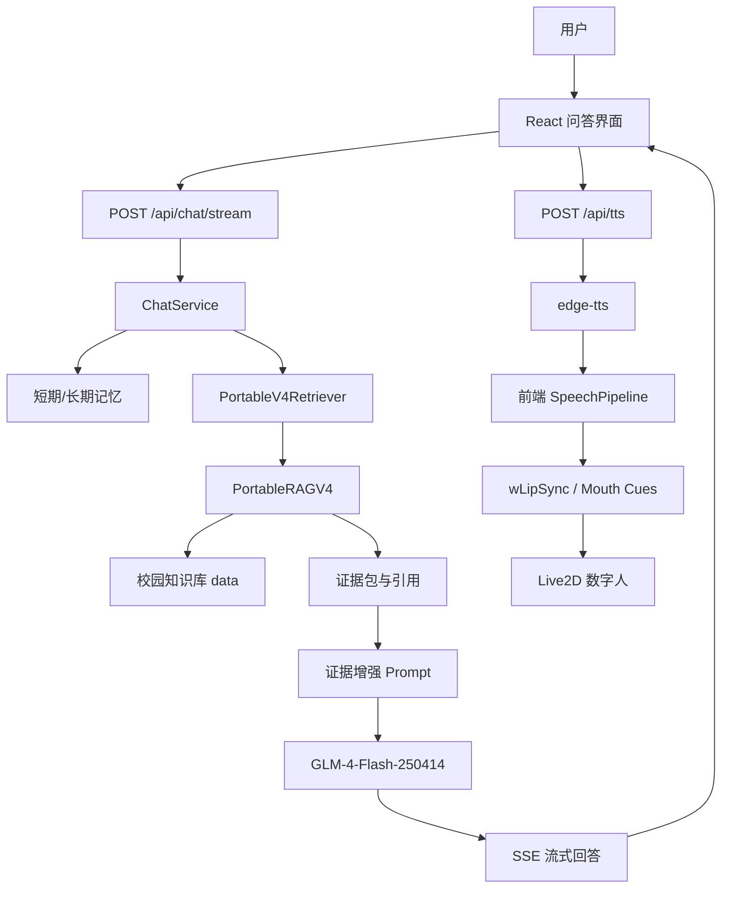

# 系统设计素材

本文件用于写第 4 章“系统设计”和第 5 章“系统实现”。

## 总体设计思路

平台采用前后端分离结构。后端负责大模型调用、知识库检索、记忆管理和语音合成，前端负责问答交互、知识来源展示、Live2D 数字人渲染、语音播放和口型动作同步。

系统设计坚持以下原则：

- RAG 证据优先：大模型回答必须围绕知识库证据组织。
- 本地轻量运行：不依赖本地 GPU，不进行训练或微调。
- 可迁移：知识库差异通过数据和配置表达，不在 Python 代码里写固定问题规则。
- 可解释：返回知识来源、检索状态和系统状态。
- 可表现：数字人不仅展示静态模型，还需要语音、口型、动作、表情和待机行为。

## 系统总体架构图



## 后端模块说明

### 配置管理

文件：

```text
backend/core/config.py
```

作用：

- 从 `.env` 读取 LLM、RAG、TTS、记忆路径。
- 支持 `zhipu` 和 `gemini` provider。
- 统一管理 `RAG_STRATEGY=portable_v4`。

### RAG 适配器

文件：

```text
backend/rag/retrievers/portable_v4.py
```

作用：

- 后端平台不直接耦合实验区细节。
- 通过适配器加载 `PortableRAGV4`。
- 将实验区 `AnswerPack` 转换成平台 `RetrievedDocument`。
- 在 metadata 中保留 answer、status、confidence、citations、trace。

### 聊天服务

文件：

```text
backend/services/chat_service.py
```

可写点：

- 接收用户输入。
- 调用 RAG 检索。
- 组织上下文 prompt。
- 调用 GLM。
- 通过 SSE 输出 status、sources、retrieval、token、sentence、avatar、done 等事件。
- 大模型限速或异常时提供兜底。

### TTS 服务

文件：

```text
backend/avatar/tts.py
```

可写点：

- 使用 `edge-tts`。
- 提供多中文音色。
- 返回音频二进制。
- 在 response header 中返回 `X-AIRI-Mouth-Cues`，供前端口型同步。

## 前端模块说明

### 问答界面

文件：

```text
frontend/src/App.jsx
```

可写点：

- 系统状态栏。
- 聊天消息区。
- 知识来源卡片。
- 模型选择。
- TTS 音色和语速选择。
- 数字人调试入口。

### 聊天逻辑

文件：

```text
frontend/src/hooks/useChatLogic.js
```

可写点：

- 接收 SSE 流。
- 增量显示回答。
- 解析动作 special token。
- 将句子送入 TTS pipeline。
- 保证前端不显示动作 token。

### 数字人舞台

文件：

```text
frontend/src/avatar/live2dStageManager.js
```

可写点：

- 模型加载。
- 模型切换。
- 自适应缩放。
- idle motion。
- 点击/交互动作。
- 自动眨眼和眼球注视。

### 逐模型 profile

文件：

```text
frontend/src/avatar/modelProfilePresets.js
```

可写点：

- 不同模型口型参数名不同。
- 不同模型原生 motion group 不同。
- 不同模型需要不同缩放、位置、开口强度和平滑参数。
- profile 化后新增模型只需补配置，不必重写主逻辑。

## 数据流设计

| 阶段 | 输入 | 输出 |
|---|---|---|
| 用户提问 | 文本问题 | ChatRequest |
| RAG 检索 | 问题、知识库 | hits、citations、confidence |
| 大模型生成 | 问题、证据、系统提示 | 流式回答 |
| 前端显示 | token、sources | 回答文本、知识来源 |
| TTS | 句子文本、voice、rate | 音频、mouth cues |
| 数字人 | 音频、mouth cues、action | 口型、动作、表情 |

## 可写成创新点的工程设计

- 将 RAG 实验系统通过 adapter 接入平台，使研究模块和业务平台解耦。
- 使用 SSE 流式输出提升回答响应体验。
- 将动作 token 从后端语义规划到前端 motion 映射解耦。
- 使用 AIRI 风格音频 pipeline 解决语音排队延迟问题。
- 用逐模型 profile 统一管理 Live2D 模型差异。

