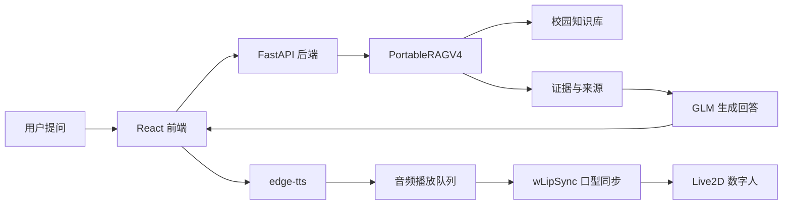
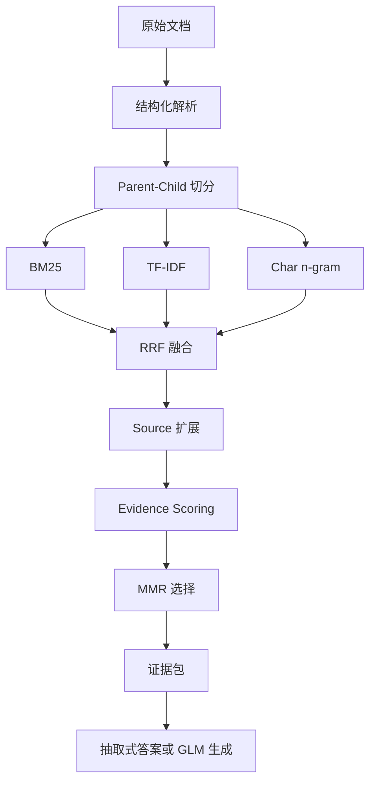
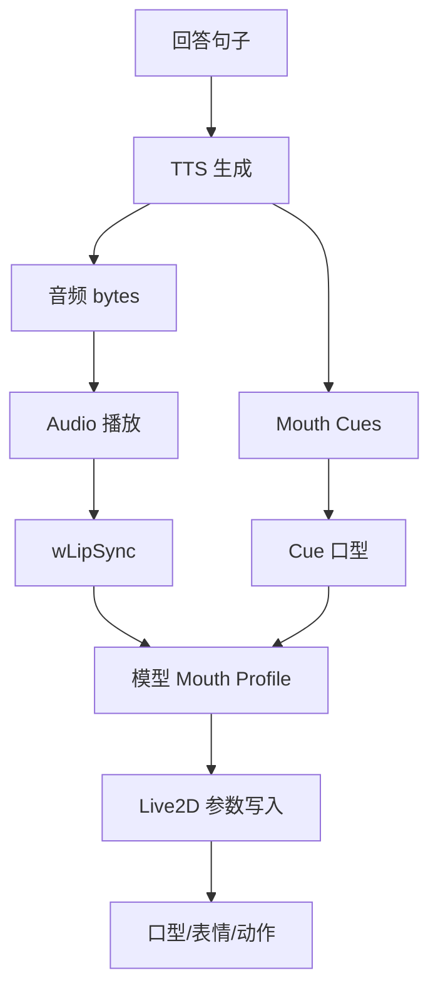

# 图表清单

本文件用于论文和答辩 PPT 的图表准备。

## 建议论文图

| 编号 | 图名 | 来源/绘制方式 | 所属章节 |
|---|---|---|---|
| 图 1-1 | 数字人智能问答平台应用场景图 | 自绘：用户、校园知识库、数字人助手 | 第 1 章 |
| 图 2-1 | RAG 基本流程图 | 自绘：文档、索引、检索、生成 | 第 2 章 |
| 图 3-1 | 系统功能需求图 | 自绘：问答、来源、TTS、数字人、调试 | 第 3 章 |
| 图 4-1 | 系统总体架构图 | 使用 `04_system_design_materials.md` Mermaid 图重绘 | 第 4 章 |
| 图 4-2 | 后端模块结构图 | FastAPI、ChatService、RAG、TTS、Memory | 第 4 章 |
| 图 4-3 | 前端模块结构图 | React、Live2D、Audio、DebugPanel | 第 4 章 |
| 图 4-4 | 问答数据流图 | 用户提问到数字人播报的 sequence diagram | 第 4 章 |
| 图 5-1 | PortableRAGV4 流程图 | 文档结构化、多路检索、RRF、证据评分、MMR | 第 5 章 |
| 图 5-2 | 数字人口型同步流程图 | TTS、mouth cues、wLipSync、Live2D 参数 | 第 5 章 |
| 图 5-3 | AIRI 迁移模块映射图 | AIRI upstream 到本项目模块 | 第 5 章 |
| 图 6-1 | RAG 分层评估框架图 | 检索层、证据层、答案层、安全层 | 第 6 章 |
| 图 6-2 | 平台最终运行截图 | 浏览器截图 | 第 6 章 |

## 建议论文表

| 编号 | 表名 | 内容 | 所属章节 |
|---|---|---|---|
| 表 2-1 | RAG 相关研究对比 | RAG、CRAG、DeepNote、LightRAG、UltraRAG | 第 2 章 |
| 表 2-2 | RAG 评估方法对比 | RAGAS、ARES、RAGChecker、RAGEval | 第 2 章 |
| 表 3-1 | 功能需求表 | 问答、来源、TTS、数字人、调试 | 第 3 章 |
| 表 3-2 | 非功能需求表 | 本地运行、轻量、可迁移、可评估 | 第 3 章 |
| 表 4-1 | 后端接口表 | `/api/system/status` 等接口 | 第 4 章 |
| 表 5-1 | PortableRAGV4 模块表 | 检索器、融合、评分、选择、拒答 | 第 5 章 |
| 表 5-2 | Live2D 模型 profile 表 | 模型、口型参数数、特点 | 第 5 章 |
| 表 6-1 | 实验数据规模表 | 74 文件、35.01 MB、1264 正例、60 负例 | 第 6 章 |
| 表 6-2 | 检索与证据代理指标 | source_hit_at_k 等 | 第 6 章 |
| 表 6-3 | 答案级严格标注指标 | strict accuracy、usable accuracy 等 | 第 6 章 |
| 表 6-4 | 最终运行验收结果 | 前后端、RAG、TTS、Live2D | 第 6 章 |

## 可直接使用的架构图

## RAG 流程图

## 数字人流程图

## 截图建议

答辩 PPT 最少准备 4 张截图：

- 平台首页：显示数字人、状态栏、问答框。
- 一次校园问答结果：显示回答和知识来源。
- 系统状态/控制面板展开：显示模型、RAG、TTS、知识库大小。
- 表现调试面板展开：显示 profile、motion、Level、嘴型参数。

